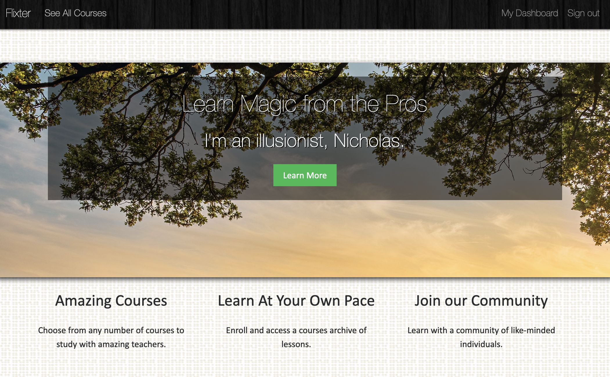
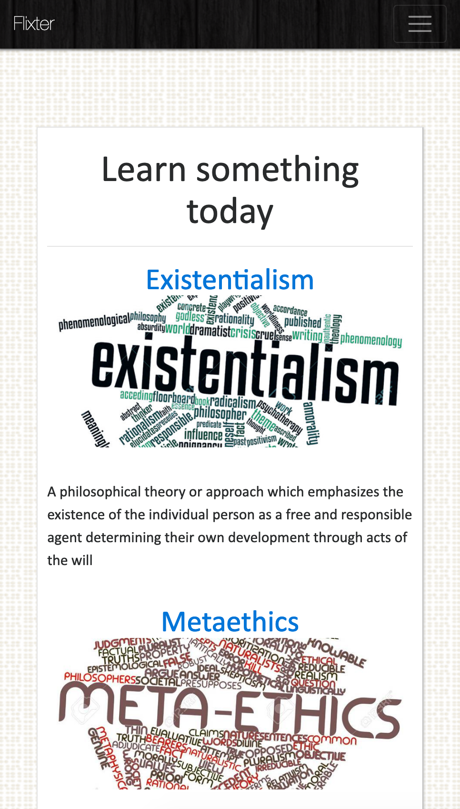

<h1>Flixter</h1>
<h3>Ruby on Rails with JavaScript and jQuery.

You can checkout Flixter here: https://flixter-nicholas-fearns.herokuapp.com/. Sign up, enroll into a course, make your own course, and have fun learning!</h3>
<h2>Features:</h2>
<ul>
 <li>     Easy to use platform for teachers to make courses and take payments from students. </li> 

 <li>     Stripe is used to process payments by students purchasing courses made by teachers.</li> 

 <li>     Teachers can customize course lessons and sections with ease, changing the order of lessons or sections throuhg the use of jQuery.</li> 

  <li>    Uses Amazon Web Services (S3) for photos and videos.</li> 

  <li>    Devise for user security, sign-in forms, etc.</li> 

   <li>   Users are not just limited to one role. They can be both students and teachers with restricted Admin access if creating a course.</li> 

   <li>   The User Dadhsborard shows all courses that students are enrolled in and all courses teachers are teaching.</li> 
</ul>

Here is the main landing page which greets users on arrival.

Here is the course page, showing some of the User uploaded courses available.

